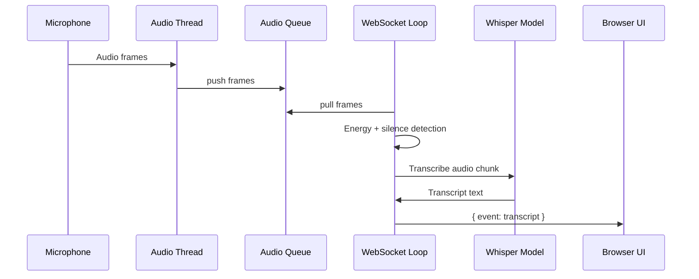

# 🎙️ Real-Time Speech-to-Text Backend (Whisper + FastAPI)

This project is a **real-time speech-to-text (STT) backend** that captures microphone audio, detects speech, transcribes it using **OpenAI Whisper**, and streams transcripts live to a browser UI via **WebSockets**.

It is designed to be:

- ✅ **Stable** (no segfaults, defensive logging)
- ✅ **Cross-platform** (macOS, Windows, Linux)
- ✅ **Low-latency** (near real-time transcription)
- ✅ **Production-safe** (thread isolation, queue buffering)

---

## 🧠 System Overview

High-level flow:

1. Microphone audio is captured continuously
2. Audio frames are buffered in a thread-safe queue
3. Energy-based VAD (voice activity detection) identifies speech
4. Speech chunks are passed to Whisper for transcription
5. Transcripts are streamed to the UI over WebSockets

---

## 🧱 File Structure

```
backend/
├── main.py              # FastAPI app, audio capture, WebSocket streaming
├── transcriber.py       # Whisper model loading + transcription logic
├── requirements.txt     # Python dependencies
├── venv/                # Python virtual environment (local)
└── README.md            # Project documentation
```

### `main.py`

Responsible for:

- FastAPI application setup
- WebSocket lifecycle management
- Audio capture via `sounddevice`
- Thread-safe audio buffering
- Speech detection (energy + silence timeout)
- Streaming transcripts to the UI

Key design decisions:

- **Audio runs in a daemon thread** (prevents blocking FastAPI)
- **Queues isolate audio from async WebSocket loop**
- **Defensive logging** ensures uvicorn never crashes

---

### `transcriber.py`

Responsible for:

- Loading the Whisper model once (cached)
- Normalizing raw audio input
- Running Whisper transcription safely

Whisper is only invoked when:

- Speech energy exceeds threshold
- Silence timeout is reached (end of utterance)

---

## 🧰 Tech Stack

### Backend

- **Python 3.10**
- **FastAPI** – async web framework
- **Uvicorn** – ASGI server
- **WebSockets** – real-time streaming

### Audio & ML

- **sounddevice** – cross-platform microphone capture
- **NumPy** – audio processing
- **OpenAI Whisper** – speech-to-text model
- **PyTorch** – Whisper runtime

### Concurrency

- **threading** – audio capture isolation
- **queue.Queue** – thread-safe buffering
- **asyncio** – non-blocking WebSocket loop

---

## 🔁 Sequence Diagram



---

## 🔌 WebSocket Contract (Formal)

### Endpoint

```
/ws
```

### Server → Client Messages

#### 1. Transcript Event

Sent when speech is detected and transcribed.

```json
{
  "event": "transcript",
  "text": "Hello, this is a test transcription"
}
```

---

### Client → Server Messages

Currently **not required**.

The backend operates in **server-push mode** and does not expect
any payloads from the client after connection.

---

### Connection Lifecycle

1. Client opens WebSocket connection
2. Server accepts and starts audio capture
3. Server streams transcript events
4. On disconnect:

   - Audio thread is stopped
   - Resources are cleaned safely

---

## ▶️ How to Run Locally

### 1. Clone the Repository

```bash
git clone <your-repo-url>
cd backend
```

---

### 2. Create Virtual Environment

```bash
python3.10 -m venv venv
source venv/bin/activate   # macOS / Linux
venv\Scripts\activate      # Windows
```

---

### 3. Install Dependencies

```bash
pip install --upgrade pip
pip install -r requirements.txt
```

> ⚠️ **macOS note**
>
> The following environment variable is set automatically in `main.py`
> to prevent OpenMP crashes:
>
> ```bash
> KMP_DUPLICATE_LIB_OK=TRUE
> ```

---

### 4. Run the Backend

```bash
uvicorn main:app
```

You should see:

```
🚀 Backend fully started
🎙️ Audio worker started
```

---

### 5. Connect the UI

- Open the frontend UI
- Ensure it connects to:

```
ws://127.0.0.1:8000/ws
```

- Speak into the microphone
- Transcripts will stream live

---

## ✅ Current Status

- ✔️ Audio capture working
- ✔️ Speech detection stable
- ✔️ Whisper transcription working
- ✔️ WebSocket streaming confirmed
- ✔️ macOS / Windows / Linux safe

---

## 🚀 Future Enhancements (Non-Breaking)

- Partial (streaming) transcripts
- Speaker diarization
- Language override support
- Audio input selection
- Transcript confidence scores
- File-based transcription mode

---

## 🧠 Key Stability Principles

- Never block the event loop
- Never run ML inside callbacks
- Never trust audio input
- Always isolate threads
- Always log defensively

---

**This system is intentionally simple, stable, and extensible.**
